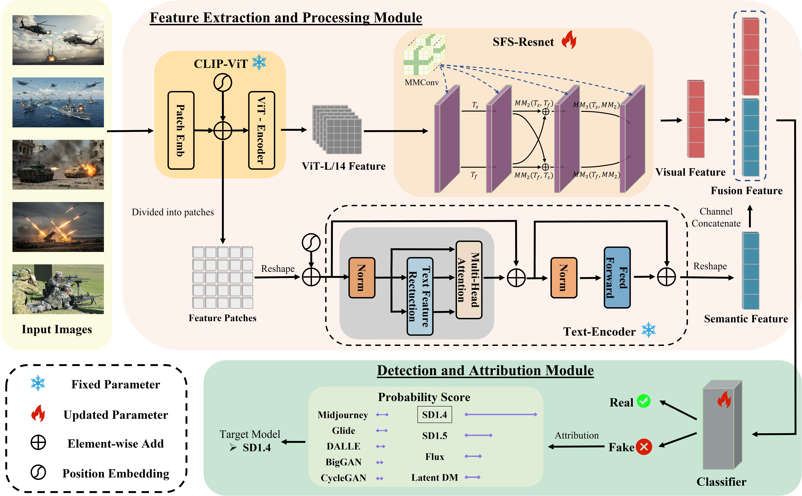

# 🚀 [ExDA: Towards Universal Detection and Plug-and-Play Attribution of AI-Generated Ex-Regulatory Images]
🚀 We will organize the remaining code and update it as soon as possible...

[](你的会议链接)
[](你的arXiv链接)
[](LICENSE)
<!-- 
    说明：
    - 上面的徽章（Badges）可以提升专业感。请将 "会议简称"、"年份"、"论文ID" 和对应的链接替换成你自己的信息。
    - 如果没有arXiv，可以删除第二行。
    - License可以根据你的项目选择，例如 MIT, Apache 2.0 等。
-->

> Our paper has been accepted to **[The 33rd ACM International Conference on Multimedia (MM'25)]**.

<p align="center">
  
    
<i> Figure 3: Our Framework Overview: Input images are divided into patches using CLIP. The patches undergo feature extraction
through a frozen ViT and are processed by the SFS-ResNet module, resulting in highly discriminative visual features. Meanwhile, the
patches are processed through a text encoder that incorporates a built-in text feature reduction layer and remains frozen, resulting in
the extraction of consistent semantic features. Finally, they are concatenated and fed into the detection and attribution module. </i>
 </p>

## 📝 Abstract
> As image-generative AI models become increasingly accessible to the public, the demand for content safety has surged. Although model developers have introduced alignment mechanisms to prevent the creation of threatening images, and extensive researches have been conducted on verifying the authenticity of AI-generated images, a significant number of ex-regulatory images have been discovered that fall into regulatory gaps. These images are neither covered by existing alignment mechanisms nor included in the scope of current detection methods. To address this, we introduce ExDA, a detection and attribution framework specifically designed for such ex-regulatory images. ExDA utilizes a frozen CLIP:ViT-L/14 as a visual feature extractor to extract rich and unbiased visual features, complemented by a text feature reduction layer to unify semantic styles. For obtaining highly discriminative features, ExDA introduces an SFS-ResNet network, where each basic layer is replaced with a meticulously designed Multi-Channel Margin Convolution (MMConv). Additionally, a plug-and-play multi-generation model attributor is integrated behind the detector. Given the lack of ex-regulatory images in existing public datasets, we constructed ExImage, a dataset containing 72,000 ex-regulatory images, to validate ExDA's effectiveness. Experiments show that ExDA achieves an average detection accuracy of 99.07\% on ExImage, and demonstrating significant performance improvements of +5.73\% and +10.36\% on GenImage and high-challenge Chameleon datasets respectively in cross-datasets evaluation. Notably, ExDA also achieves excellent performance in attribution tasks, demonstrating its superior ability to identify the intrinsic fingerprints of generative models. Our code is publicly available on the author's homepage.

<br>

## ✨ Main Contributions
Our contributions of this paper can be outlined as follows:

*   **(1)**: We develop an efficient framework ExDA for AI-generated ex-regulatory images detection and attribution. ExDA incorporates frozen CLIP:ViT-L/14 as visual feature extraction module to extract unbiased and robust visual features. To effectively process these diverse and complex visual features, a specialized feature processing network called SFS-ResNet is proposed. This network replaces every foundational layer with MMConv, which not only effectively filters out redundant information but also obtains high-frequency and discriminative feature representations.

*   **(2)**: ExDA decouples the frozen text encoder from CLIP:ViT-L/14 and introduces a text feature reduction layer before its multi-head attention. This design aims to minimize the impact of specific image content on the detection process.

*   **(3)**: ExDA also features a plug-and-play and highly extendable attribution plugin, which requires only a small number of unseen generated model images to memorize underlying fingerprint features, resolving accountability issues in real-world scenarios.

*   **(4)**: The ExImage dataset is developed for the detection of ex-regulatory images. Such ex-regulatory images have received minimal research attention, yet they are crucial for social stability and national security.


<br>

## 🛠️ Setup

1.  **克隆本仓库**
    ```bash
    git clone https://github.com/[你的用户名]/[你的仓库名].git
    cd [你的仓库名]
    ```

2.  **创建虚拟环境并安装依赖**
    我们建议使用 [Anaconda](https://www.anaconda.com/) 来管理环境：
    ```bash
    conda create -n [你的环境名] python=3.8
    conda activate [你的环境名]
    ```
    然后安装所需的包：
    ```bash
    pip install -r requirements.txt
    ```
    <!-- 说明：请在你的项目根目录中创建一个 `requirements.txt` 文件，并列出所有依赖项。 -->

<br>

## ▶️ 运行代码 (Usage)

### 1. 数据准备 (Data Preparation)
[这里说明如何准备数据集。例如：]
> 请从 [数据集链接] 下载数据集，并将其解压到 `./data/` 目录下。目录结构应如下所示：
> ```
> .
> ├── data
> │   ├── dataset_name
> │   │   ├── train
> │   │   ├── val
> │   │   └── test
> ...
> ```

### 2. 模型训练 (Training)
使用以下命令来训练你的模型：
```bash
python train.py --config configs/your_config_file.yaml --output_dir /path/to/save
```
<!-- 说明：请根据你的实际运行命令进行修改。 -->

### 3. 模型评估 (Evaluation)
使用我们提供的预训练模型进行评估：
```bash
python evaluate.py --checkpoint /path/to/your/checkpoint.pth --config configs/your_config_file.yaml
```
<!-- 说明：如果提供预训练模型，请说明下载链接和放置位置。 -->

<br>

## 🏆 主要结果 (Results)
[这里展示你的主要实验结果，可以使用表格或图片。]

**[数据集A] 上的性能对比**

| 方法 (Method)      | 指标1 (e.g., Accuracy) | 指标2 (e.g., F1-Score) |
| ------------------ | ---------------------- | ---------------------- |
| Baseline           | xx.x%                  | xx.x%                  |
| 方法A (XXX et al.) | xx.x%                  | xx.x%                  |
| **我们的方法 (Ours)** | **xx.x%**              | **xx.x%**              |

<br>

## 📜 引用 (Citation)
如果我们的工作对您有所帮助，请考虑引用我们的论文：
```bibtex
@inproceedings{
  [你的引用标签，例如：zhang2024yourtitle],
  title={[你的论文标题]},
  author={[作者一 and 作者二 and ...]},
  booktitle={[会议全称]},
  year={[年份]}
}
```

<br>

## 🙏 致谢 (Acknowledgements)
[此处可以添加致谢信息，例如：]
*   感谢 [某某人/某某组织] 提供的计算资源。
*   本项目的代码结构参考了 [某个开源项目链接]。
*   感谢...

---
